## Hi, I'm Shan Wu 👨🏻‍💻
*🎓 Ph.D. from the [ITS Lab](https://its.cs.ut.ee/home/), [University of Tartu](https://ut.ee/en).*

*Specialized in **Computer Vision (CV)**, **Machine Learning (ML)**, and **Intelligent Transportation Systems (ITS)**.*

*Also a cat person, swimmer, photography & gym enthusiast.*

## GitHub Statistics

  <picture>
    <source media="(prefers-color-scheme: dark)" srcset="./profile/stats-dark.svg" />
    <source media="(prefers-color-scheme: light)" srcset="./profile/stats-light.svg" />
    
  </picture>
  <picture>
    <source media="(prefers-color-scheme: dark)" srcset="./profile/top-langs-dark.svg" />
    <source media="(prefers-color-scheme: light)" srcset="./profile/top-langs-light.svg" />
    
  </picture>

  <picture>
    <source media="(prefers-color-scheme: dark)" srcset="./profile/snake-dark.svg" />
    <source media="(prefers-color-scheme: light)" srcset="./profile/snake-light.svg" />
    
  </picture>

Cards are generated daily by <a href="https://github.com/stats-organization/github-readme-stats-action">github-readme-stats-action</a> and <a href="https://github.com/Platane/snk">Platane/snk</a> (see <code>.github/workflows/readme-cards.yml</code>).

<!--
**simonwu53/simonwu53** is a ✨ _special_ ✨ repository because its `README.md` (this file) appears on your GitHub profile.

Here are some ideas to get you started:

- 🔭 I’m currently working on ...
- 🌱 I’m currently learning ...
- 👯 I’m looking to collaborate on ...
- 🤔 I’m looking for help with ...
- 💬 Ask me about ...
- 📫 How to reach me: ...
- 😄 Pronouns: ...
- ⚡ Fun fact: ...

-->
